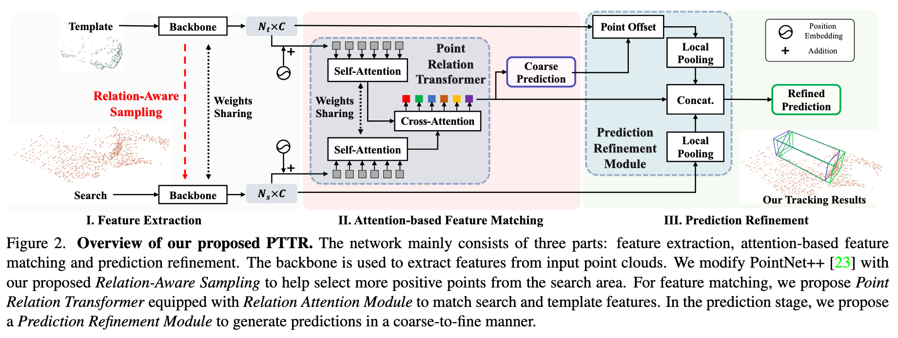

# Implementation of paper "PTTR: Relational 3D Point Cloud Object Tracking with Transformer" (CVPR2022)

## Introduction

The network mainly consists of three parts: feature extraction, attention-based feature matching and prediction refinement. The backbone is used to extract features from input point clouds. We modify PointNet++ with our proposed Relation-Aware Sampling to help select more positive points from the search area. For feature matching, we propose Point Relation Transformer equipped with Relation Attention Module to match search and template features. In the prediction stage, we propose a Prediction Refinement Module to generate predictions in a coarse-to-fine manner.



Please kindly refer to the [Paper](https://arxiv.org/abs/2112.02857) for details.

## Installation
Create conda environment and install pytorch. Tested with pytorch 1.4.0 and CUDA 10.0. Might work with other versions as well, but not tested.
```sh
conda create -n pttr python=3.7
conda activate pttr
conda install pytorch==1.4.0 torchvision==0.5.0 cudatoolkit=10.0 -c pytorch
```
Install dependencies
```sh
pip install -r requirements.txt
python setup.py build_ext --inplace
```

## Data Preparation
### KITTI Tracking Dataset
Download the dataset from [KITTI Tracking](http://www.cvlibs.net/datasets/kitti/eval_tracking.php).

Download [velodyne](http://www.cvlibs.net/download.php?file=data_tracking_velodyne.zip), [calib](http://www.cvlibs.net/download.php?file=data_tracking_calib.zip) and [label_02](http://www.cvlibs.net/download.php?file=data_tracking_label_2.zip) in the dataset and place them under the same parent folder (e.g., ./data/kitti).

```
PTTR
├── data
    ├── kitti
        ├── calib
        ├── label_02
        └── velodyne
```

### Waymo Tracking Dataset
The dataset generation relies on [OpenPCDet](https://github.com/open-mmlab/OpenPCDet) (included in this repo). The commit of OpenPCDet we used is a35f429768b3aa6ea2e7cd0a6452e1fcb7671c8d and we make some modifications to suit the purposes of tracking data generation, please follow the steps to generate the Waymo tracking dataset. 

* Download the official [Waymo Open Dataset](https://waymo.com/open/download/), 
including the training data `training_0000.tar~training_0031.tar` and the validation 
data `validation_0000.tar~validation_0007.tar`.
* Unzip all the above `xxxx.tar` files to the directory of `./OpenPCDet/data/waymo/raw_data` as follows:  
```
PTTR
├──OpenPCDet
    ├── data
    │   ├── waymo
    │   │   │── ImageSets
    │   │   │── raw_data
    │   │   │   │── segment-xxxxxxxx.tfrecord
    |   |   |   |── ...
```
* Install OpenPCdet.
```sh
cd OpenPCDet
python setup.py develop
```

* Preprocess the data. This might take quite a while.
```sh
# go back to the root dir
cd ..
python -m pcdet.datasets.waymo.waymo_dataset --func create_waymo_infos --cfg_file waymo_dataset.yaml
```
* Generate the tracking dataset.
```sh
python waymo_dataset.py
```

## Training and Testing
Train with the KITTI dataset (e.g., for the cyclist class)
```
python train_tracking.py --category_name Cyclist --save_root_dir results/kitti/Cyclist
```
Test with the KITTI dataset. Checkpoints are provided at ```checkpoints/kitti/```
```
python test_tracking.py --category_name Cyclist --save_root_dir results/kitti/Cyclist --model netR_10.pth
```
Train with the Waymo dataset (e.g., for the vehicle class)
```
python train_tracking_waymo.py --category_name Vehicle --save_root_dir results/waymo/Vehicle
```
Test with the Waymo dataset
```
python test_tracking_waymo.py --category_name Vehicle --save_root_dir results/waymo/Vehicle --model netR_10.pth
```
## Citation
If you find PTTR useful, please consider citing:

```bibtex
@inproceedings{zhou2021pttr,
  title={PTTR: Relational 3D Point Cloud Object Tracking with Transformer},
  author={Zhou, Changqing and Luo, Zhipeng and Luo, Yueru and Liu, Tianrui and Pan, Liang and Cai, Zhongang and Zhao, Haiyu and Lu, Shijian},
  booktitle={Proceedings of the IEEE/CVF Conference on Computer Vision and Pattern Recognition (CVPR)},
  year={2022}
}
```

## Acknowledgement
This repo builds on top of [P2B](https://github.com/HaozheQi/P2B), Erik Wijmans' pytorch implementation of [PointNet++](https://github.com/erikwijmans/Pointnet2_PyTorch), and [OpenPCDet](https://github.com/open-mmlab/OpenPCDet). We wish to thank their contributions.
